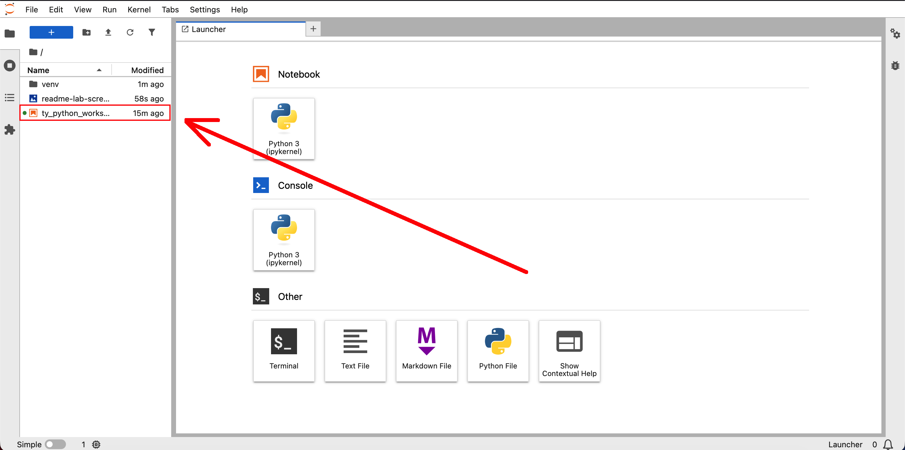

# Installation

1. Clone the repo and change the current directory to it.
```
git clone https://github.com/rh-dnagornuks/ty_python_workshop.git
cd ty_python_workshop
```

2. Create virtual Python environment, activate it, install `jupyterlab` package and run it.
```
python -m venv venv
source venv/bin/activate
pip install jupyterlab
jupyter-lab
```

3. Open the `ty_python_workshop.ipynb` notebook from the JupyterLab file browser.

